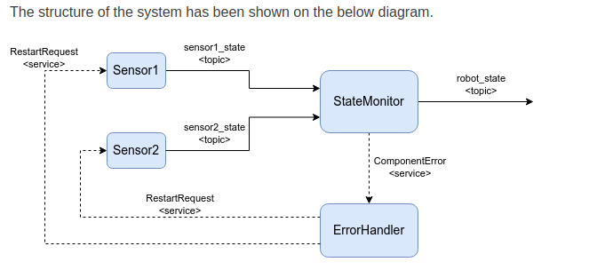

# Robot Monitoring System – ROS2 Project

## Project Overview

This ROS2 project implements a modular robot monitoring system that continuously checks the health status of various sensors (e.g., LIDAR, camera). If a sensor fails or stops responding, the system detects the issue, logs it, and attempts to recover it automatically by calling a custom service.

## System Architecture

The system is divided into three main node types:

### 1. State Monitor Node
- Subscribes to `/[sensor_name]_state` topics published by each sensor.
- Monitors whether each sensor publishes a `True` (healthy) signal within a configured time window.
- Detects errors if:
  - A sensor fails to publish in time.
  - A sensor explicitly publishes a `False` signal.
- If an error is detected:
  - It notifies the ErrorHandler node via a custom service.
  - Publishes the system's overall status on the `/robot_state` topic.

### 2. Error Handler Node
- Implements a custom service server to receive error notifications from the State Monitor.
- When a sensor error is reported:
  - It sends a restart request to the corresponding sensor node using another custom service.

### 3. Sensor Nodes (e.g., LIDAR, Camera)
- Publish Boolean status messages periodically to `/[sensor_name]_state`.
- Implement a service server to handle restart requests and simulate recovery behavior.

## Features

- Modular ROS2 node design (each node has a single responsibility).
- Configuration of sensor names, check intervals, and thresholds via YAML files.
- Custom ROS2 services for:
  - Error notification
  - Sensor restart with progress feedback
- Centralized monitoring with automatic sensor recovery.

## How to Launch

1. Place all source code inside your ROS2 workspace under packages `my_monitoring_package` and `my_service`.

2. Build and source the workspace:
   ```bash
   colcon build
   source install/setup.bash
   ```

3. Launch the monitor and error handler nodes with a single command:
   ```bash
   ros2 launch my_monitoring_package monitor_launch.py
   ```

4. Start sensor nodes separately (each in its own terminal or launch file).

## Customization

- All parameters (sensor list, check frequency, timeout durations) should be placed in `*.yaml` config files.
- You can extend the system by adding more sensor types or more advanced recovery strategies.

## System Diagram

The architecture of the system is illustrated below:




## Testing Tips

- Use `rqt_graph` to visualize node connections.
- Simulate sensor failure by pausing their publishers or publishing `False`.
- Use `ros2 topic echo` to observe system state topics like `/robot_state`.

## Summary

This project demonstrates real-world robotics principles:
- Fault detection
- Node orchestration
- Parameterization
- Recovery via service-based interaction

It is designed to be extensible and forms a great foundation for developing more robust robot monitoring frameworks in ROS2.

